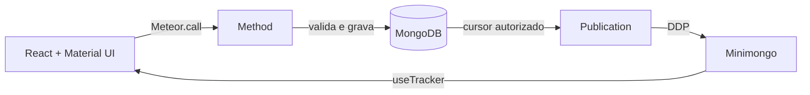

# Tutorial autoinstrucional: ToDo List Avançado no Boilerplate Meteor + React

> Público-alvo: pessoas que conhecem TypeScript e React, mas ainda estão formando o modelo mental de Meteor 3 e deste
> boilerplate.
>
> Objetivo: construir um módulo `toDos` completo, reativo e seguro, desde a preparação do ambiente até os testes,
> índices, observabilidade, acessibilidade e decisões de produção.
>
> Stack utilizada: Meteor 3.5, Node 24, React 19 e Material UI 7.

---

## Sumário

1. [Como estudar com este tutorial](#1-como-estudar-com-este-tutorial)
2. [O produto que você vai construir](#2-o-produto-que-você-vai-construir)
3. [O modelo mental do Meteor](#3-o-modelo-mental-do-meteor)
4. [Arquitetura do boilerplate](#4-arquitetura-do-boilerplate)
5. [Preparação e critérios de pronto](#5-preparação-e-critérios-de-pronto)
6. [Modelagem do domínio](#6-modelagem-do-domínio)
7. [Criando a estrutura do módulo](#7-criando-a-estrutura-do-módulo)
8. [Schema e API de cliente](#8-schema-e-api-de-cliente)
9. [Publicações, métodos e segurança](#9-publicações-métodos-e-segurança)
10. [Registro, recursos e índices](#10-registro-recursos-e-índices)
11. [Rotas e container](#11-rotas-e-container)
12. [Tela de lista](#12-tela-de-lista)
13. [Criação, visualização e edição](#13-criação-visualização-e-edição)
14. [Atividades recentes na Home](#14-atividades-recentes-na-home)
15. [Notificações e modal](#15-notificações-e-modal)
16. [Responsividade e tema](#16-responsividade-e-tema)
17. [Validação e testes](#17-validação-e-testes)
18. [Aprendizados adicionais](#18-aprendizados-adicionais)
19. [Erros frequentes](#19-erros-frequentes)
20. [Checklist final](#20-checklist-final)
21. [Glossário](#21-glossário)

---

## 1. Como estudar com este tutorial

Este não é um exercício de copiar arquivos. Em cada etapa, siga este ciclo:

1. leia o **modelo mental**;
2. implemente o **passo obrigatório**;
3. execute o **checkpoint**;
4. explique com suas palavras por que o controle está no cliente ou no servidor;
5. só então avance.

Ao longo do texto, três etiquetas ajudam a separar responsabilidades:

- **Conceito Meteor:** mecanismo oferecido pelo framework, como Method, Publication ou Minimongo;
- **Padrão do boilerplate:** convenção local, como `ProductBase`, `ProductServerBase`, `SysForm` e recursos;
- **Regra do ToDo:** decisão deste domínio, como “somente o autor conclui ou exclui”.

### O erro do desenvolvedor apressado

Trocar nomes em um CRUD existente não produz automaticamente uma aplicação segura. Ao final, você deve saber responder:

- por que esconder o botão de excluir não protege o banco;
- por que tarefas pessoais são filtradas na publicação;
- por que a busca é montada no servidor;
- por que a página recebe apenas quatro registros;
- por que “concluir” é um comando de domínio, não uma edição genérica;
- por que Publication e Method resolvem problemas diferentes.

> **Regra de ouro**
>
> O cliente descreve a intenção. O servidor valida identidade, entrada, autorização e estado antes de executar essa
> intenção.

---

## 2. O produto que você vai construir

O resultado será um módulo de tarefas disponível apenas após login, com:

- criação, visualização, edição e exclusão;
- marcação de tarefa concluída/não concluída;
- tarefas públicas para todos os usuários autenticados;
- tarefas pessoais visíveis apenas para o autor;
- edição, conclusão e exclusão permitidas apenas ao autor;
- busca textual executada no MongoDB pelo servidor;
- paginação de quatro tarefas;
- cinco atividades recentes na Home;
- feedback de sucesso e erro pelo `showNotification`;
- visualização rápida em dialog;
- layout responsivo e estados de loading/vazio/erro;
- prioridades e prazo para exercitar regras de domínio adicionais.

### 2.1 Requisitos funcionais e técnicos

| Requisito | Entrega neste tutorial                                    |
| --------- | --------------------------------------------------------- |
| RF-01     | rotas protegidas e métodos/publicações autenticados       |
| RF-02     | Home com cinco tarefas recentes e link “Minhas Tarefas”   |
| RF-03     | CRUD, lista Material UI, conclusão, dialog e notificações |
| RF-04     | ownership validado no backend                             |
| RF-05     | campo `pessoal` com `SysSwitch` e filtro na publicação    |
| RF-06     | busca com debounce, limite e regex escapada no servidor   |
| RF-07     | ícone e estilo diferentes para tarefa concluída           |
| RF-08     | paginação server-side com `skip` e `limit = 4`            |
| RF-09     | breakpoints, acessibilidade e customização de tema        |

### 2.2 Aprendizados adicionais

Adicionaremos `prioridade`, `prazo`, `concluidaEm`, índices, projeções mínimas, um comando atômico para alternar estado,
testes negativos, analytics sem dados sensíveis e uma trilha opcional para arquivamento e lembretes.

### 2.3 Fluxo final



Observe a volta completa: a UI não altera o MongoDB diretamente. Ela envia um comando ao Method; o servidor grava; a
Publication atualiza o Minimongo; o React renderiza o novo estado.

---

## 3. O modelo mental do Meteor

### 3.1 Method: uma intenção de mudança

Um Method é uma função remota executada no servidor. Use-o para “criar tarefa”, “editar”, “excluir” ou
“alternar conclusão”. No Meteor 3, o corpo do servidor é assíncrono e deve aguardar `findOneAsync`, `insertAsync`,
`updateAsync` e `removeAsync`.

### 3.2 Publication: uma janela autorizada

Uma Publication não é um endpoint que devolve um array. Ela mantém um conjunto autorizado de documentos sincronizado
com o Minimongo do cliente.

Para este exercício haverá três janelas:

- `toDos.toDosList`: a página corrente, já filtrada e paginada;
- `toDos.toDosDetail`: um documento visível ao usuário;
- `toDos.toDosRecent`: as cinco atividades recentes visíveis ao usuário.

### 3.3 Minimongo: cache reativo, não fonte de autoridade

`toDosApi.find(...)` no cliente consulta apenas os documentos publicados naquela conexão. O Minimongo melhora a
experiência reativa, mas não decide autorização. Um usuário pode chamar Methods manualmente pelo console; por isso toda
escrita é conferida novamente no servidor.

### 3.4 `useTracker`: ponte entre reatividade e React

`useTracker` acompanha subscriptions e consultas reativas. Quando o servidor adiciona, altera ou remove um documento
publicado, o hook recalcula e o componente renderiza novamente.

### Checkpoint conceitual

Antes de avançar, complete mentalmente:

- **Method** protege e executa **\_\_\_\_**.
- **Publication** controla quais **\_\_\_\_** chegam ao cliente.
- **Minimongo** contém somente o que foi **\_\_\_\_** para aquela conexão.

Respostas: mudanças; documentos/campos; publicado.

---

## 4. Arquitetura do boilerplate

O módulo será dividido por responsabilidade:

```text
imports/modules/toDos/
  api/       schema e APIs de cliente/servidor
  config/    recursos, rotas e menu
  pages/     controllers, views e estilos
  toDosContainer.tsx
```

| Peça                        | Responsabilidade                                  |
| --------------------------- | ------------------------------------------------- |
| `toDosSch.ts`               | contrato compartilhado de campos                  |
| `toDosApi.ts`               | coleção cliente, subscriptions e chamadas remotas |
| `toDosServerApi.ts`         | Methods, Publications e políticas do domínio      |
| `toDosListController.tsx`   | estado de busca/página e integração reativa       |
| `toDosListView.tsx`         | apresentação Material UI                          |
| `toDosDetailController.tsx` | carregamento e persistência do formulário         |
| `toDosDetailView.tsx`       | `SysForm` e campos                                |
| `recursos.ts`               | capacidades gerais do módulo                      |
| `toDosRouters.tsx`          | proteção e code splitting das rotas               |

`ProductBase` e `ProductServerBase` reduzem o código repetitivo, mas não conhecem as regras de privacidade e ownership
do ToDo. Essas regras serão explícitas no servidor.

> **Importante**
>
> Recursos respondem “este papel pode atualizar tarefas?”. Ownership responde “este usuário pode atualizar esta tarefa
> específica?”. As duas verificações são necessárias.

---

## 5. Preparação e critérios de pronto

### 5.1 Ambiente

Use Node 24 e Meteor 3.5. Confirme antes de instalar dependências:

```bash
node --version
meteor --version
```

Na raiz do repositório, instale e valide:

```bash
meteor npm ci
npm run typecheck
meteor run --settings settings.json
```

Se `settings.json` ainda não existir, crie-o na raiz com configuração local sem segredos:

```json
{
	"public": {
		"name": "MeteorReactBase-MUI",
		"maps": { "api": "" },
		"serviceWorker": { "enabled": false }
	},
	"private": {
		"service": "MeteorReactBase-MUI"
	}
}
```

O comando `meteor run` inicia o MongoDB local automaticamente. Em produção, `ROOT_URL`, `MONGO_URL`,
`MEDIA_ACCESS_TOKEN` e origens CORS exatas são obrigatórios, mas não são necessários para concluir este exercício local.

Acesse `http://localhost:3000`, faça login e confirme que as rotas atuais funcionam.

Se ainda não houver administrador local, pare a aplicação e faça um único startup com as três variáveis abaixo. A senha
precisa ter pelo menos 14 caracteres:

```bash
export DEFAULT_ADMIN_USERNAME='Administrador'
export DEFAULT_ADMIN_EMAIL='admin@exemplo.local'
export DEFAULT_ADMIN_PASSWORD='uma-senha-inicial-forte'
meteor run --settings settings.json
```

Depois do primeiro login, troque a senha, encerre o processo e remova as três variáveis. O bootstrap é idempotente por
e-mail e não existe senha administrativa padrão. A criação de conta pelo cliente permanece bloqueada, a menos que o
ambiente defina conscientemente `ALLOW_CLIENT_ACCOUNT_CREATION=true`.

Para obter duas contas verificadas sem depender de SMTP, repita o bootstrap uma segunda vez com outro e-mail, nome e
senha. O primeiro startup cria “Usuário A”; depois pare o servidor, altere as três variáveis para “Usuário B” e inicie
novamente. Como a criação é idempotente por e-mail, as duas contas permanecerão no banco. Remova as variáveis e faça o
startup normal. As duas contas terão papel `Administrador`, que herda os recursos de `Usuario`; as regras de ownership
implementadas neste tutorial continuam impedindo que uma altere os documentos da outra. Abra cada conta em um perfil
separado do navegador para manter duas sessões simultâneas.

### 5.2 Baseline

Antes de editar, registre:

```bash
npm run typecheck
npm test -- --port 3102
```

Se algo já falhar, diferencie o problema anterior do problema introduzido pelo tutorial.

### 5.3 Definição de pronto

Ao final, dois usuários de teste devem demonstrar:

1. ambos enxergam uma tarefa pública;
2. apenas o autor enxerga sua tarefa pessoal;
3. apenas o autor altera, conclui ou exclui sua tarefa;
4. busca, recentes e paginação são processados no servidor;
5. atualizar um item em um navegador atualiza o outro reativamente;
6. typecheck, testes e build passam.

---

## 6. Modelagem do domínio

### 6.1 Vocabulário

| Campo         | Tipo            | Regra                                               |
| ------------- | --------------- | --------------------------------------------------- |
| `descricao`   | `string`        | obrigatória, entre 3 e 200 caracteres               |
| `prioridade`  | enum textual    | `baixa`, `media` ou `alta`                          |
| `prazo`       | `Date` opcional | informação adicional de planejamento                |
| `pessoal`     | `boolean`       | quando `true`, somente o autor pode ler             |
| `concluida`   | `boolean`       | nasce `false`; muda apenas pelo comando específico  |
| `concluidaEm` | `Date` opcional | preenchida/limpa junto com `concluida`              |
| `autorNome`   | `string`        | cópia controlada pelo servidor para a lista         |
| `createdby`   | auditoria       | identificador do perfil autor, preenchido pela base |

### 6.2 Invariantes

- toda tarefa tem autor autenticado;
- o cliente não escolhe `autorNome`, `createdby`, `concluida` nem `concluidaEm`;
- somente o autor altera ou exclui;
- tarefa pessoal só aparece ao autor;
- concluir e reabrir atualizam estado e timestamp atomicamente;
- busca tem no máximo 80 caracteres e nunca vira regex sem escape;
- a página é inteira positiva e o servidor fixa quatro registros.

### 6.3 Por que `autorNome` é desnormalizado?

A lista precisa exibir o nome do autor. Consultar `userprofile` para cada linha criaria N+1 consultas e uma publicação
composta mais cara. Guardar uma fotografia do nome torna a listagem simples. A consequência é que renomear o perfil não
altera tarefas antigas automaticamente. Em um produto real, decida conscientemente entre fotografia histórica,
publicação composta ou rotina de atualização.

---

## 7. Criando a estrutura do módulo

Crie exatamente os arquivos abaixo. O boilerplate não possui gerador integrado e este tutorial fornece o contrato de
cada peça necessária.

```text
imports/modules/toDos/
├── api/
│   ├── toDosApi.ts
│   ├── toDosSch.ts
│   └── toDosServerApi.ts
├── config/
│   ├── index.tsx
│   ├── recursos.ts
│   ├── toDosAppMenu.tsx
│   └── toDosRouters.tsx
├── pages/
│   ├── toDosDetail/
│   │   ├── toDosDetailController.tsx
│   │   ├── toDosDetailStyles.tsx
│   │   └── toDosDetailView.tsx
│   └── toDosList/
│       ├── toDosListController.tsx
│       ├── toDosListStyles.tsx
│       └── toDosListView.tsx
└── toDosContainer.tsx
```

### Checkpoint

Ainda não importe o módulo nos agregadores. Rode `npm run typecheck` somente depois de criar os primeiros arquivos com
exports válidos; imports de arquivos vazios apenas produzem ruído.

---

## 8. Schema e API de cliente

### 8.1 `api/toDosSch.ts`

```ts
import { IDoc } from '/imports/typings/IDoc';
import { ISchema } from '/imports/typings/ISchema';

export type ToDoPrioridade = 'baixa' | 'media' | 'alta';

export const toDosSch: ISchema<IToDo> = {
	descricao: {
		type: String,
		label: 'Descrição',
		defaultValue: '',
		optional: false,
		validationFunction: (value: string) => {
			const tamanho = value?.trim().length ?? 0;
			if (tamanho < 3 || tamanho > 200) return 'Informe entre 3 e 200 caracteres.';
			return undefined;
		}
	},
	prioridade: {
		type: String,
		label: 'Prioridade',
		defaultValue: 'media',
		optional: false,
		options: () => [
			{ value: 'baixa', label: 'Baixa' },
			{ value: 'media', label: 'Média' },
			{ value: 'alta', label: 'Alta' }
		]
	},
	prazo: {
		type: Date,
		label: 'Prazo',
		optional: true
	},
	pessoal: {
		type: Boolean,
		label: 'Tarefa pessoal',
		defaultValue: false,
		optional: true
	},
	concluida: {
		type: Boolean,
		label: 'Concluída',
		defaultValue: false,
		optional: true,
		readOnly: true
	},
	concluidaEm: {
		type: Date,
		label: 'Concluída em',
		optional: true,
		readOnly: true
	},
	autorNome: {
		type: String,
		label: 'Criada por',
		optional: true,
		readOnly: true
	}
};

export interface IToDo extends IDoc {
	descricao: string;
	prioridade: ToDoPrioridade;
	prazo?: Date;
	pessoal: boolean;
	concluida: boolean;
	concluidaEm?: Date | null;
	autorNome?: string;
}
```

**Por que os campos controlados pelo servidor ainda aparecem no schema?** A base usa o schema para transportar e
validar documentos. `readOnly` orienta a UI, mas a proteção real virá dos hooks e do Method. Nunca confie em `readOnly`
como autorização.

### 8.2 `api/toDosApi.ts`

```ts
import { ProductBase } from '/imports/api/productBase';
import { IToDo, toDosSch } from './toDosSch';

export type AlternarConclusaoResult = {
	concluida: boolean;
	mensagem: string;
};

class ToDosApi extends ProductBase<IToDo> {
	constructor() {
		super('toDos', toDosSch, {
			enableCallMethodObserver: true
		});
	}

	alternarConclusao(id: string): Promise<AlternarConclusaoResult> {
		return this.callMethodWithPromise('alternarConclusao', id);
	}
}

export const toDosApi = new ToDosApi();
```

O nome `toDos` é importante: ele forma a coleção, o prefixo dos Methods (`toDos.insert`) e das Publications
(`toDos.toDosList`). Também deve corresponder ao prefixo dos recursos `TODOS_*` usado pela classe base.

### Checkpoint

```bash
npm run typecheck
```

Se falhar, resolva agora. Não continue acumulando arquivos inválidos.

---

## 9. Publicações, métodos e segurança

Esta é a etapa central. A UI pode mudar; as regras abaixo não podem depender dela.

### 9.1 Contrato de listagem

O cliente não enviará um seletor Mongo. Ele enviará apenas um DTO:

```ts
export type ToDosListInput = {
	search?: string;
	status?: 'todas' | 'abertas' | 'concluidas';
	page?: number;
};
```

No servidor, valide chaves e tipos antes de montar a consulta:

```ts
import { check, Match } from 'meteor/check';

const listInputPattern = Match.Where((value: unknown) => {
	if (!value || typeof value !== 'object' || Array.isArray(value)) return false;
	const input = value as Record<string, unknown>;
	if (Object.keys(input).some((key) => !['search', 'status', 'page'].includes(key))) return false;
	if (input.search !== undefined && (typeof input.search !== 'string' || input.search.length > 80)) return false;
	if (input.status !== undefined && !['todas', 'abertas', 'concluidas'].includes(String(input.status))) return false;
	if (
		input.page !== undefined &&
		(!Number.isInteger(input.page) || Number(input.page) < 1 || Number(input.page) > 10_000)
	)
		return false;
	return true;
});
```

### 9.2 Seletor de visibilidade

```ts
import { escapeRegExp } from '/imports/libs/escapeRegExp';

const buildVisibleSelector = (userId: string, input: ToDosListInput = {}) => {
	const clauses: Record<string, unknown>[] = [{ $or: [{ pessoal: { $ne: true } }, { createdby: userId }] }];

	const search = input.search?.trim();
	if (search) clauses.push({ descricao: { $regex: escapeRegExp(search), $options: 'i' } });
	if (input.status === 'abertas') clauses.push({ concluida: { $ne: true } });
	if (input.status === 'concluidas') clauses.push({ concluida: true });

	return clauses.length === 1 ? clauses[0] : { $and: clauses };
};
```

Esse seletor implementa a privacidade no lugar correto. Uma tarefa pessoal de outro usuário nunca entra no cursor
publicado.

### 9.3 `api/toDosServerApi.ts`

Crie `api/toDosServerApi.ts` com a implementação abaixo.

```ts
import { Meteor } from 'meteor/meteor';
import { check, Match } from 'meteor/check';
import { ProductServerBase } from '/imports/api/productServerBase';
import { IContext } from '/imports/typings/IContext';
import { escapeRegExp } from '/imports/libs/escapeRegExp';
import { getUserServer } from '/imports/modules/userprofile/api/userProfileServerApi';
import { segurancaApi } from '/imports/security/api/segurancaApi';
import { Recurso } from '../config/recursos';
import { IToDo, toDosSch } from './toDosSch';

export type ToDosListInput = {
	search?: string;
	status?: 'todas' | 'abertas' | 'concluidas';
	page?: number;
};

const PAGE_SIZE = 4;

// Inclua aqui listInputPattern e buildVisibleSelector apresentados acima.

const assertAuthenticated = (context: IContext) => {
	if (!context.user?._id || !context.user.email) {
		throw new Meteor.Error('not-authorized', 'Autenticação obrigatória.');
	}
};

const prepareEditableFields = (doc: Partial<IToDo>) => {
	const descricao = doc.descricao?.trim() ?? '';
	if (descricao.length < 3 || descricao.length > 200) {
		throw new Meteor.Error('validation-error', 'A descrição deve ter entre 3 e 200 caracteres.');
	}
	if (!doc.prioridade || !['baixa', 'media', 'alta'].includes(doc.prioridade)) {
		throw new Meteor.Error('validation-error', 'Prioridade inválida.');
	}
	if (doc.pessoal !== undefined && typeof doc.pessoal !== 'boolean') {
		throw new Meteor.Error('validation-error', 'Visibilidade inválida.');
	}
	if (doc.prazo != null && (!(doc.prazo instanceof Date) || Number.isNaN(doc.prazo.getTime()))) {
		throw new Meteor.Error('validation-error', 'Prazo inválido.');
	}
	doc.descricao = descricao;
};

class ToDosServerApi extends ProductServerBase<IToDo> {
	constructor() {
		super('toDos', toDosSch, { resources: Recurso });

		this.addPublication('toDosList', async (input: ToDosListInput = {}) => {
			check(input, listInputPattern);
			const user = await getUserServer();
			if (!user.email) throw new Meteor.Error('not-authorized', 'Autenticação obrigatória.');
			segurancaApi.validarAcessoRecursos(user, [Recurso.TODOS_VIEW]);

			const page = input.page ?? 1;
			return this.getCollectionInstance().find(buildVisibleSelector(user._id!, input), {
				fields: {
					descricao: 1,
					prioridade: 1,
					prazo: 1,
					pessoal: 1,
					concluida: 1,
					concluidaEm: 1,
					autorNome: 1,
					createdby: 1,
					lastupdate: 1
				},
				sort: { lastupdate: -1, _id: 1 },
				skip: (page - 1) * PAGE_SIZE,
				limit: PAGE_SIZE
			});
		});

		this.addPublication('toDosDetail', async (id: string) => {
			check(id, String);
			const user = await getUserServer();
			if (!user.email) throw new Meteor.Error('not-authorized', 'Autenticação obrigatória.');
			segurancaApi.validarAcessoRecursos(user, [Recurso.TODOS_VIEW]);

			return this.getCollectionInstance().find(
				{ $and: [{ _id: id }, buildVisibleSelector(user._id!)] },
				{
					fields: {
						descricao: 1,
						prioridade: 1,
						prazo: 1,
						pessoal: 1,
						concluida: 1,
						concluidaEm: 1,
						autorNome: 1,
						createdby: 1,
						createdat: 1,
						lastupdate: 1
					}
				}
			);
		});

		this.addPublication('toDosRecent', async () => {
			const user = await getUserServer();
			if (!user.email) throw new Meteor.Error('not-authorized', 'Autenticação obrigatória.');
			segurancaApi.validarAcessoRecursos(user, [Recurso.TODOS_VIEW]);

			return this.getCollectionInstance().find(buildVisibleSelector(user._id!), {
				fields: { descricao: 1, concluida: 1, pessoal: 1, prioridade: 1, lastupdate: 1 },
				sort: { lastupdate: -1, _id: 1 },
				limit: 5
			});
		});

		this.registerMethod('alternarConclusao', this.alternarConclusao.bind(this));
		this.registerTotalPublication();
	}

	private registerTotalPublication() {
		const collection = this.getCollectionInstance();
		Meteor.publish('toDos.total', async function (input: ToDosListInput = {}) {
			check(input, listInputPattern);
			const user = await getUserServer();
			if (!user.email) return this.ready();
			segurancaApi.validarAcessoRecursos(user, [Recurso.TODOS_VIEW]);

			const total = await collection.find(buildVisibleSelector(user._id!, input)).countAsync();
			// Use um id diferente do contador automático criado por addPublication.
			this.added('counts', 'toDosFilteredTotal', { count: total });
			this.ready();
		});
	}

	async beforeInsert(doc: Partial<IToDo>, context: IContext) {
		await super.beforeInsert(doc, context);
		assertAuthenticated(context);
		prepareEditableFields(doc);

		doc.pessoal ??= false;
		doc.concluida = false;
		delete doc.concluidaEm;
		doc.autorNome = context.user.username;
		return true;
	}

	async beforeUpdate(doc: Partial<IToDo>, context: IContext) {
		await super.beforeUpdate(doc, context);
		assertAuthenticated(context);
		await this.assertOwner(doc._id, context);
		prepareEditableFields(doc);

		delete doc.concluida;
		delete doc.concluidaEm;
		delete doc.autorNome;
		return true;
	}

	async beforeRemove(doc: Partial<IToDo>, context: IContext) {
		await super.beforeRemove(doc, context);
		assertAuthenticated(context);
		await this.assertOwner(doc._id, context);
		return true;
	}

	async countDocuments(context?: IContext) {
		if (!context) throw new Meteor.Error('not-authorized', 'Autenticação obrigatória.');
		assertAuthenticated(context);
		segurancaApi.validarAcessoRecursos(context.user, [Recurso.TODOS_VIEW]);
		return this.getCollectionInstance().find(buildVisibleSelector(context.user._id!)).countAsync();
	}

	private async assertOwner(id: string | undefined, context: IContext) {
		check(id, String);
		const owned = await this.getCollectionInstance().findOneAsync(
			{ _id: id, createdby: context.user._id },
			{ fields: { _id: 1 } }
		);
		if (!owned) throw new Meteor.Error('not-authorized', 'Somente o autor pode realizar esta operação.');
	}

	private async alternarConclusao(id: string, context: IContext) {
		check(id, String);
		assertAuthenticated(context);
		segurancaApi.validarAcessoRecursos(context.user, [Recurso.TODOS_UPDATE]);

		const tarefa = await this.getCollectionInstance().findOneAsync(
			{ _id: id, createdby: context.user._id },
			{ fields: { concluida: 1 } }
		);
		if (!tarefa) throw new Meteor.Error('not-authorized', 'Somente o autor pode alterar a tarefa.');

		const concluida = !tarefa.concluida;
		const now = new Date();
		await this.getCollectionInstance().updateAsync(
			{ _id: id, createdby: context.user._id },
			{
				$set: {
					concluida,
					concluidaEm: concluida ? now : null,
					lastupdate: now,
					updatedby: context.user._id
				}
			}
		);

		return {
			concluida,
			mensagem: concluida ? 'Tarefa concluída com sucesso.' : 'Tarefa reaberta com sucesso.'
		};
	}
}

export const toDosServerApi = new ToDosServerApi();
```

### 9.4 O que esse servidor garante

- `check` rejeita DTO desconhecido;
- regras de tamanho, enum, boolean e data são repetidas no servidor; a validação do `SysForm` é apenas UX;
- `escapeRegExp` impede que a busca vire uma expressão arbitrária;
- a visibilidade faz parte do seletor reativo;
- listagem fixa projeção, sort e limite;
- hooks impedem edição e remoção por terceiros;
- campos de sistema são sobrescritos ou removidos;
- conclusão usa um comando específico e um seletor atômico com ownership;
- até o contador genérico herdado respeita a visibilidade do usuário;
- mensagens do comando vêm do backend.

### 9.5 Uma sutileza sobre `concluidaEm`

MongoDB armazena `null` ao reabrir na implementação acima. Se você preferir ausência do campo, faça duas operações
condicionais com `$set`/`$unset`, mantendo o seletor de ownership. Escolha um contrato e teste-o; não misture `undefined`,
`null` e ausência sem intenção.

### Checkpoint de segurança

Abra o console do navegador como usuário B e tente chamar manualmente:

```js
Meteor.call('toDos.remove', { _id: 'ID_DA_TAREFA_DO_USUARIO_A' }, console.log);
Meteor.call('toDos.alternarConclusao', 'ID_DA_TAREFA_DO_USUARIO_A', console.log);
```

Ambas devem falhar. Esse teste demonstra por que segurança de UI não basta.

---

## 10. Registro, recursos e índices

### 10.1 Recursos

Em `config/recursos.ts`:

```ts
export enum Recurso {
	TODOS_VIEW = 'TODOS_VIEW',
	TODOS_CREATE = 'TODOS_CREATE',
	TODOS_UPDATE = 'TODOS_UPDATE',
	TODOS_REMOVE = 'TODOS_REMOVE'
}
```

Em `imports/security/config/mapRolesRecursos.tsx`, importe os recursos e conceda-os a `RoleType.USUARIO`:

```ts
import { Recurso as ToDos } from '/imports/modules/toDos/config/recursos';

// Dentro de RoleType.USUARIO:
..._getAllValues(ToDos),
```

Todos os usuários podem ter a capacidade geral; os hooks restringem cada documento ao autor.

### 10.2 API do servidor

Em `imports/server/registerApi.ts`:

```ts
import '../modules/toDos/api/toDosServerApi';
```

Sem esse import, coleção cliente e telas podem existir, mas Methods e Publications não serão registrados.

### 10.3 Índices

Em `imports/server/databaseIndexes.ts`, importe `toDosServerApi` e inclua:

```ts
const toDos = toDosServerApi.getCollectionInstance();

await Promise.all([
	// índices já existentes...
	toDos.createIndexAsync({ pessoal: 1, createdby: 1, lastupdate: -1 }),
	toDos.createIndexAsync({ createdby: 1, lastupdate: -1 }),
	toDos.createIndexAsync({ concluida: 1, lastupdate: -1 })
]);
```

A busca `regex` não ancorada em `descricao` não aproveita um índice B-tree convencional. Para grande volume, evolua
para campo normalizado com estratégia apropriada, índice textual ou Atlas Search. Não prometa escalabilidade apenas por
adicionar `{ descricao: 1 }`.

### Checkpoint

Reinicie o servidor e procure no terminal o startup sem erro de registro ou índice. Depois:

```bash
npm run typecheck
```

---

## 11. Rotas e container

### 11.1 Menu

Em `config/toDosAppMenu.tsx`:

```tsx
import React from 'react';
import { IAppMenu } from '/imports/modules/modulesTypings';
import SysIcon from '/imports/ui/components/sysIcon/sysIcon';

export const toDosMenuItemList: (IAppMenu | null)[] = [
	{
		path: '/to-dos',
		name: 'Minhas Tarefas',
		icon: <SysIcon name="task" />
	}
];
```

### 11.2 Rotas com permissões explícitas

Evite uma rota dinâmica que trate `create`, `edit` e `view` com o mesmo recurso. Em `config/toDosRouters.tsx`:

```tsx
import React from 'react';
import asyncComponent from '/imports/libs/asyncComponent';
import { IRoute } from '/imports/modules/modulesTypings';
import { Recurso } from './recursos';

const ToDosContainer = asyncComponent(() => import('../toDosContainer'));

const CreateToDo = () => <ToDosContainer screenState="create" />;
const EditToDo = () => <ToDosContainer screenState="edit" />;
const ViewToDo = () => <ToDosContainer screenState="view" />;

export const toDosRouterList: (IRoute | null)[] = [
	{
		path: '/to-dos/create/:toDoId',
		component: CreateToDo,
		isProtected: true,
		resources: [Recurso.TODOS_CREATE]
	},
	{
		path: '/to-dos/edit/:toDoId',
		component: EditToDo,
		isProtected: true,
		resources: [Recurso.TODOS_UPDATE]
	},
	{
		path: '/to-dos/view/:toDoId',
		component: ViewToDo,
		isProtected: true,
		resources: [Recurso.TODOS_VIEW]
	},
	{
		path: '/to-dos',
		component: ToDosContainer,
		isProtected: true,
		resources: [Recurso.TODOS_VIEW]
	}
];
```

O requisito de autenticação é atendido no roteamento com `isProtected`, mas também foi atendido no servidor. Essa
intencional: a rota cuida da experiência; o backend cuida da segurança.

### 11.3 Agregador do módulo

`config/index.tsx`:

```tsx
import { IModuleHub } from '/imports/modules/modulesTypings';
import { toDosMenuItemList } from './toDosAppMenu';
import { toDosRouterList } from './toDosRouters';

const ToDos: IModuleHub = {
	pagesRouterList: toDosRouterList,
	pagesMenuItemList: toDosMenuItemList
};

export default ToDos;
```

Em `imports/modules/index.ts`, importe `ToDos`, espalhe suas rotas em `pages` e seu menu em `menuItens`.

### 11.4 Container

`toDosContainer.tsx`:

```tsx
import React from 'react';
import { useParams } from 'react-router-dom';
import { IDefaultContainerProps } from '/imports/typings/BoilerplateDefaultTypings';
import ToDosListController from './pages/toDosList/toDosListController';
import ToDosDetailController from './pages/toDosDetail/toDosDetailController';

type ScreenState = 'create' | 'edit' | 'view';

export type ToDosModuleContextValue = {
	state?: ScreenState;
	id?: string;
};

export const ToDosModuleContext = React.createContext<ToDosModuleContextValue>({});

const ToDosContainer: React.FC<IDefaultContainerProps> = (props) => {
	const { toDoId } = useParams();
	const state = props.screenState as ScreenState | undefined;
	const id = toDoId ?? props.id;

	return (
		<ToDosModuleContext.Provider value={{ state, id }}>
			{state ? <ToDosDetailController /> : <ToDosListController />}
		</ToDosModuleContext.Provider>
	);
};

export default ToDosContainer;
```

### Checkpoint de navegação

Após reiniciar, o menu deve exibir “Minhas Tarefas”. Acessar `/to-dos` deslogado deve redirecionar para login; logado,
deve carregar o chunk do módulo sem erro.

---

## 12. Tela de lista

A lista é onde reatividade, busca, paginação, ownership e Material UI se encontram.

### 12.1 Estado mínimo do controller

Em `toDosListController.tsx`, mantenha separados o texto digitado e o filtro efetivamente enviado ao servidor:

```tsx
const PAGE_SIZE = 4;
const [searchText, setSearchText] = React.useState('');
const [search, setSearch] = React.useState('');
const [status, setStatus] = React.useState<'todas' | 'abertas' | 'concluidas'>('todas');
const [page, setPage] = React.useState(1);

React.useEffect(() => {
	const timer = window.setTimeout(() => {
		setSearch(searchText.trim().slice(0, 80));
		setPage(1);
	}, 400);
	return () => window.clearTimeout(timer);
}, [searchText]);
```

O cleanup impede que cada tecla dispare uma busca atrasada.

### 12.2 Subscription e Minimongo

```tsx
import { Meteor } from 'meteor/meteor';
import { useTracker } from 'meteor/react-meteor-data';
import { countsCollection } from '/imports/api/countCollection';
import { toDosApi } from '../../api/toDosApi';

const input = React.useMemo(() => ({ search, status, page }), [search, status, page]);

const { tarefas, total, loading } = useTracker(() => {
	const listHandle = Meteor.subscribe('toDos.toDosList', input);
	const totalHandle = Meteor.subscribe('toDos.total', { search, status });
	const ready = listHandle.ready() && totalHandle.ready();

	return {
		tarefas: ready ? toDosApi.find({}, { sort: { lastupdate: -1, _id: 1 } }).fetch() : [],
		total: countsCollection.findOne({ _id: 'toDosFilteredTotal' })?.count ?? 0,
		loading: !ready
	};
}, [input, search, status]);
```

Aqui usamos `Meteor.subscribe` diretamente porque `ProductBase.subscribe` também abre o contador automático da
Publication. Esse contador mede apenas a página limitada; o tutorial precisa de um total filtrado separado. O wrapper
continua apropriado para publicações que seguem o contrato genérico de contador do boilerplate.

Neste fluxo, a rota de lista mantém somente a publicação paginada ativa para `toDos`. Se você mantiver outras
publicações da mesma coleção simultaneamente, não consulte simplesmente `{}`: documentos de Publications são mesclados
no Minimongo. Nesse cenário, use seletores locais compatíveis ou uma coleção publicada separada.

### 12.3 Ações do controller

```tsx
import { nanoid } from 'nanoid';
import { getUser } from '/imports/libs/getUser';

const navigate = useNavigate();
const layout = React.useContext(AppLayoutContext);
const currentUserId = getUser()._id;

const adicionar = () => navigate(`/to-dos/create/${nanoid()}`);
const visualizar = (id: string) => navigate(`/to-dos/view/${id}`);
const editar = (id: string) => navigate(`/to-dos/edit/${id}`);

const alternarConclusao = async (id: string) => {
	try {
		const result = await toDosApi.alternarConclusao(id);
		layout.showNotification({ type: 'success', message: result.mensagem });
	} catch (error: any) {
		layout.showNotification({
			type: 'error',
			title: 'Operação não realizada',
			message: error.reason ?? 'Não foi possível alterar a tarefa.'
		});
	}
};

const excluir = (tarefa: IToDo) => {
	layout.showDialog({
		title: 'Excluir tarefa',
		message: `Deseja realmente excluir “${tarefa.descricao}”?`,
		actions: (
			<>
				<Button variant="text" onClick={() => layout.closeDialog()}>
					Cancelar
				</Button>
				<Button
					color="error"
					variant="contained"
					onClick={() => {
						toDosApi.remove(tarefa, (error: IMeteorError) => {
							if (error) {
								layout.showNotification({
									type: 'error',
									message: error.reason ?? 'Não foi possível excluir a tarefa.'
								});
								return;
							}
							layout.closeDialog();
							layout.showNotification({ type: 'success', message: 'Tarefa excluída.' });
						});
					}}>
					Excluir
				</Button>
			</>
		)
	});
};
```

Inclua nos imports desse controller `Button`, `IToDo` e `IMeteorError`. Observe que a mensagem positiva só aparece no
callback de sucesso; o frontend nunca anuncia a exclusão antes de o backend confirmar.

### 12.4 View com `List`

Na view, use componentes Material UI:

```tsx
<List aria-label="Lista de tarefas">
	{controller.tarefas.map((tarefa) => {
		const isOwner = tarefa.createdby === controller.currentUserId;
		return (
			<ListItem
				key={tarefa._id}
				secondaryAction={
					isOwner && (
						<Box>
							<IconButton aria-label="Editar tarefa" onClick={() => controller.editar(tarefa._id!)}>
								<SysIcon name="edit" />
							</IconButton>
							<IconButton aria-label="Excluir tarefa" onClick={() => controller.excluir(tarefa)}>
								<SysIcon name="delete" />
							</IconButton>
						</Box>
					)
				}>
				<Checkbox
					edge="start"
					checked={tarefa.concluida}
					disabled={!isOwner}
					onChange={() => controller.alternarConclusao(tarefa._id!)}
					inputProps={{ 'aria-label': `Alternar conclusão de ${tarefa.descricao}` }}
				/>
				<ListItemButton onClick={() => controller.abrirModal(tarefa)}>
					<ListItemIcon>
						<SysIcon name={tarefa.concluida ? 'checkCircle' : 'task'} color="primary" />
					</ListItemIcon>
					<ListItemText
						primary={tarefa.descricao}
						secondary={`Criada por ${tarefa.autorNome ?? 'Usuário'}`}
						primaryTypographyProps={{
							textDecoration: tarefa.concluida ? 'line-through' : 'none'
						}}
					/>
				</ListItemButton>
			</ListItem>
		);
	})}
</List>
```

Acima da lista, adicione:

- `SysTextField` para `searchText`;
- `SysSelectField` com `todas`, `abertas` e `concluidas`;
- texto informando quantidade de resultados.

Abaixo:

```tsx
<Pagination
	page={controller.page}
	count={Math.max(1, Math.ceil(controller.total / 4))}
	onChange={(_event, value) => controller.setPage(value)}
	color="primary"
/>
```

Use `SysFab` para “Adicionar”. Durante loading mostre `SysLoading`; quando `tarefas.length === 0`, mostre uma mensagem
de vazio em vez de uma área em branco.

### 12.5 Checkpoint de busca e paginação

No DevTools, digite rapidamente na busca. Depois de 400 ms deve surgir apenas uma nova subscription relevante. Crie
cinco tarefas e confirme que a primeira página mostra quatro e a segunda mostra uma. Inspecione no servidor que `skip`
e `limit` são aplicados antes da publicação.

---

## 13. Criação, visualização e edição

Crie o controller de detalhe aplicando três regras essenciais:

1. assine `toDosDetail` somente em `edit`/`view`;
2. impeça a experiência de edição quando o documento não pertence ao usuário;
3. não renderize campos controlados pelo servidor no formulário editável.

### 13.1 Carregamento

```tsx
import { Meteor } from 'meteor/meteor';

const { id, state } = React.useContext(ToDosModuleContext);
const navigate = useNavigate();
const { showNotification } = React.useContext(AppLayoutContext);
const closePage = () => navigate('/to-dos');

const { document, loading } = useTracker(() => {
	if (state === 'create' || !id) {
		return {
			document: {
				_id: id,
				descricao: '',
				prioridade: 'media',
				pessoal: false,
				concluida: false
			} as IToDo,
			loading: false
		};
	}

	const handle = Meteor.subscribe('toDos.toDosDetail', id);
	const document = handle?.ready() ? toDosApi.findOne({ _id: id }) : undefined;
	return { document: document as IToDo, loading: !handle?.ready() };
}, [id, state]);
```

Quando `state === 'edit'`, compare `document.createdby` com `getUser()._id` depois do loading. Se forem diferentes,
notifique e navegue para `/to-dos`. Essa verificação melhora a UX; o servidor continua sendo a barreira real.

```tsx
React.useEffect(() => {
	if (state !== 'edit' || loading || !document?._id) return;
	if (document.createdby === getUser()._id) return;

	showNotification({ type: 'error', message: 'Somente o autor pode editar esta tarefa.' });
	navigate('/to-dos', { replace: true });
}, [document, loading, navigate, showNotification, state]);
```

### 13.2 Submit

```tsx
const onSubmit = (doc: IToDo) => {
	const action = state === 'create' ? 'insert' : 'update';
	toDosApi[action](doc, (error: IMeteorError) => {
		if (error) {
			showNotification({
				type: 'error',
				title: 'Operação não realizada',
				message: error.reason ?? 'Verifique os dados e tente novamente.'
			});
			return;
		}

		showNotification({
			type: 'success',
			message: state === 'create' ? 'Tarefa criada com sucesso.' : 'Tarefa atualizada com sucesso.'
		});
		navigate('/to-dos');
	});
};
```

Exponha esses valores para a view por um contexto local. Isso evita uma cadeia extensa de props e mantém o controller
responsável pela integração:

```tsx
type ToDosDetailContextValue = {
	document: IToDo;
	loading: boolean;
	schema: ISchema<IToDo>;
	state: 'create' | 'edit' | 'view';
	onSubmit: (doc: IToDo) => void;
	closePage: () => void;
};

export const ToDosDetailContext = React.createContext<ToDosDetailContextValue>({} as ToDosDetailContextValue);

return (
	<ToDosDetailContext.Provider
		value={{
			document,
			loading,
			schema: toDosApi.getSchema(),
			state: state!,
			onSubmit,
			closePage
		}}>
		<ToDosDetailView />
	</ToDosDetailContext.Provider>
);
```

Os imports necessários são `React`, `useNavigate`, `useTracker`, `Meteor`, `getUser`, `AppLayoutContext`, `ISchema`,
`IMeteorError`, `IToDo`, `toDosApi`, `ToDosModuleContext` e `ToDosDetailView`.

O erro vem do backend; a mensagem de sucesso do CRUD genérico é definida no cliente. Para levar o extra ao limite,
crie Methods `toDos.criar` e `toDos.editar` com respostas tipadas, em vez de alterar silenciosamente o contrato genérico
da base.

### 13.3 `toDosDetailView.tsx`

Dentro de `SysForm`:

```tsx
<SysForm
	mode={state as 'create' | 'edit' | 'view'}
	schema={controller.schema}
	doc={controller.document}
	onSubmit={controller.onSubmit}
	loading={controller.loading}>
	<Body>
		<SysTextField
			name="descricao"
			multiline
			rows={4}
			max={200}
			showNumberCharactersTyped
			placeholder="Ex.: Revisar os critérios de aceite do módulo"
		/>
		<SysSelectField name="prioridade" placeholder="Selecione" />
		<SysDatePickerField name="prazo" />
		<SysSwitch name="pessoal" valueLabel="Somente eu posso visualizar esta tarefa" />
	</Body>
	<Footer>
		<Button variant="outlined" onClick={controller.closePage}>
			Cancelar
		</Button>
		<SysFormButton>Salvar</SysFormButton>
	</Footer>
</SysForm>
```

No modo `view`, acrescente status, autor e datas como texto. O `SysFormButton` já não aparece nesse modo. Forneça botão
“Editar” somente ao autor.

### Checkpoint de CRUD

- nova tarefa nasce não concluída;
- salvar volta para a lista e notifica;
- editar preserva autoria e conclusão;
- marcar “pessoal” remove a tarefa da tela de outro usuário;
- erro do backend permanece legível e não apaga silenciosamente o formulário.

---

## 14. Atividades recentes na Home

O requisito de atividades recentes determina que filtro e limite sejam do servidor. A Publication `toDosRecent` já
garante visibilidade, ordenação e `limit: 5`.

Crie `imports/sysPages/pages/home/sections/recentToDos.tsx`:

```tsx
import React from 'react';
import { Meteor } from 'meteor/meteor';
import { useNavigate } from 'react-router-dom';
import { useTracker } from 'meteor/react-meteor-data';
import { Button, List, ListItem, ListItemIcon, ListItemText } from '@mui/material';
import { toDosApi } from '/imports/modules/toDos/api/toDosApi';
import SysIcon from '/imports/ui/components/sysIcon/sysIcon';
import HomeSection from '../components/section';

const RecentToDos: React.FC = () => {
	const navigate = useNavigate();
	const { tarefas, loading } = useTracker(() => {
		const handle = Meteor.subscribe('toDos.toDosRecent');
		return {
			tarefas: handle?.ready() ? toDosApi.find({}, { sort: { lastupdate: -1, _id: 1 }, limit: 5 }).fetch() : [],
			loading: !handle?.ready()
		};
	}, []);

	return (
		<HomeSection title="Atividades recentes" description="As cinco tarefas visíveis alteradas mais recentemente.">
			{loading ? (
				<span>Carregando...</span>
			) : (
				<List>
					{tarefas.map((tarefa) => (
						<ListItem key={tarefa._id}>
							<ListItemIcon>
								<SysIcon name={tarefa.concluida ? 'checkCircle' : 'task'} />
							</ListItemIcon>
							<ListItemText primary={tarefa.descricao} secondary={tarefa.concluida ? 'Concluída' : 'Não concluída'} />
						</ListItem>
					))}
				</List>
			)}
			<Button onClick={() => navigate('/to-dos')}>Minhas Tarefas</Button>
		</HomeSection>
	);
};

export default RecentToDos;
```

Importe e renderize `<RecentToDos />` em `home.tsx`. O menu “Início” já permite voltar à Home.

> **Atenção à sobreposição de Publications**
>
> Na Home, `toDosRecent` é a única janela de tarefas. Ao navegar para `/to-dos`, o componente desmonta e a subscription é
> encerrada. Se no futuro ambas permanecerem ativas no mesmo layout, reveja a consulta local porque o Minimongo mescla
> documentos recebidos por diferentes Publications da mesma coleção.

---

## 15. Notificações e modal

### 15.1 Visualização rápida

No controller da lista:

```tsx
const abrirModal = (tarefa: IToDo) => {
	layout.showDialog({
		title: tarefa.descricao,
		body: (
			<Stack spacing={1}>
				<Typography>Status: {tarefa.concluida ? 'Concluída' : 'Não concluída'}</Typography>
				<Typography>Prioridade: {tarefa.prioridade}</Typography>
				<Typography>Criada por: {tarefa.autorNome}</Typography>
				{tarefa.pessoal && <Typography>Visibilidade: pessoal</Typography>}
			</Stack>
		),
		fullScreenMediaQuery: 'sm'
	});
};
```

O dialog usa os dados já publicados na lista; não precisa abrir uma nova Publication para esses campos. Se o modal
passar a exibir dados exclusivos do detalhe, assine `toDosDetail` em um componente próprio.

### 15.2 Regra de feedback

- sucesso: somente depois da confirmação do Method;
- erro de validação/autorização: use `error.reason`, com fallback seguro;
- não exponha stack, seletor Mongo ou tokens;
- bloqueie ação repetida enquanto a Promise estiver pendente;
- feche dialog de exclusão somente após resultado confirmado.

---

## 16. Responsividade e tema

Responsividade não significa apenas “caber no celular”. A tela precisa continuar compreensível e operável.

### 16.1 Estilos da lista

Em `toDosListStyles.tsx`, crie os containers com `styled` e use breakpoints:

```tsx
import Box from '@mui/material/Box';
import { styled } from '@mui/material/styles';
import { SysSectionPaddingXY } from '/imports/ui/layoutComponents/sysLayoutComponents';

const Container = styled(SysSectionPaddingXY)(({ theme }) => ({
	display: 'flex',
	flexDirection: 'column',
	gap: theme.spacing(2),
	width: '100%',
	minHeight: '100%'
}));

const SearchContainer = styled(Box)(({ theme }) => ({
	display: 'flex',
	alignItems: 'flex-end',
	gap: theme.spacing(2),
	width: '100%',
	[theme.breakpoints.down('sm')]: {
		alignItems: 'stretch',
		flexDirection: 'column'
	}
}));

const LoadingContainer = styled(Box)(({ theme }) => ({
	display: 'grid',
	gap: theme.spacing(1),
	placeItems: 'center',
	width: '100%',
	minHeight: 240
}));

export default { Container, SearchContainer, LoadingContainer };
```

Na lista, permita quebra do texto e mantenha ações com área de toque adequada. Em telas estreitas, considere mover editar
e excluir para um menu `moreVert`, reduzindo ruído sem ocultar funcionalidade.

### 16.2 Tema

Para exercitar o boilerplate, altere uma cor semântica em `imports/ui/materialui/sysColors.ts` e confira:

- contraste de texto e ícones;
- hover, foco e disabled;
- notificações e dialogs;
- lista em viewport pequeno;
- zoom de 200%.

Não espalhe hexadecimais nos componentes. Use `theme.palette.primary`, `sysText`, `sysBackground` e `sysAction`.

### 16.3 Acessibilidade mínima

- labels em busca, filtros e switches;
- `aria-label` nos `IconButton` e checkbox;
- foco visível;
- ação de conclusão acessível por teclado;
- status não comunicado apenas por cor;
- dialog com título claro;
- loading e vazio expressos em texto.

### Checkpoint mobile

No DevTools, teste ao menos 320 px, 768 px e desktop. Não aceite scroll horizontal causado pelas ações da lista.

---

## 17. Validação e testes

### 17.1 Roteiro manual com dois usuários

Use perfis A e B, preferencialmente em navegadores/perfis separados.

| Passo | Ação                        | Resultado esperado                        |
| ----- | --------------------------- | ----------------------------------------- |
| 1     | A cria tarefa pública       | A e B visualizam                          |
| 2     | B tenta editar pelo console | servidor nega                             |
| 3     | A marca como pessoal        | desaparece para B                         |
| 4     | A conclui                   | status/ícone mudam reativamente           |
| 5     | A reabre                    | `concluida` volta a `false`               |
| 6     | criar cinco tarefas         | páginas com 4 + 1                         |
| 7     | buscar trecho da descrição  | filtro ocorre no servidor                 |
| 8     | abrir Home                  | no máximo cinco tarefas visíveis recentes |
| 9     | excluir tarefa de A como B  | servidor nega                             |
| 10    | excluir como A              | item desaparece das telas assinantes      |

Teste também entrada hostil:

- busca `.*(a+)+` deve ser tratada como texto literal;
- página `0`, fracionária ou string deve ser rejeitada;
- objeto com chave `$where` deve ser rejeitado;
- descrição vazia ou acima de 200 caracteres deve falhar;
- cliente tentando enviar `autorNome` ou `concluida` não deve controlar esses valores.

### 17.2 Testes automatizados

Extraia `buildVisibleSelector` e a normalização do input para `toDosPolicy.ts`, sem acesso à UI. Teste pelo menos:

```ts
describe('toDos policy', function () {
	it('inclui tarefas públicas e tarefas pessoais do próprio usuário', function () {
		const selector = buildVisibleSelector('user-a');
		assert.deepStrictEqual(selector, {
			$or: [{ pessoal: { $ne: true } }, { createdby: 'user-a' }]
		});
	});

	it('escapa metacaracteres na busca', function () {
		const selector = buildVisibleSelector('user-a', { search: 'a.*(b)' }) as {
			$and: Array<Record<string, any>>;
		};
		assert.deepStrictEqual(selector.$and[1], {
			descricao: { $regex: 'a\\.\\*\\(b\\)', $options: 'i' }
		});
	});
});
```

Depois acrescente testes de integração server-side para:

- insert exigir usuário autenticado;
- update/remove de outro autor retornar `not-authorized`;
- Method de conclusão alterar `concluidaEm`;
- Publication não entregar tarefa pessoal alheia;
- projeção não publicar campos futuros sensíveis.

Não encerre a estratégia apenas com testes das funções puras: o maior risco está na integração entre contexto Meteor,
coleção e hooks.

### 17.3 Gates

```bash
npm run typecheck
npm test -- --port 3102
meteor test --full-app --once --driver-package meteortesting:mocha --port 3104
meteor build /tmp/meteor-react-base-todo --directory
```

Se houver E2E configurado em ambiente suportado:

```bash
CYPRESS_BASE_URL=http://localhost:3000 npm run cypress:headless
```

---

## 18. Aprendizados adicionais

As trilhas abaixo ampliam o módulo. Implemente uma por vez, sempre com teste e critério de aceite.

### 18.1 Arquivamento em vez de exclusão física

Adicione `arquivada` e `arquivadaEm`, substitua o remove por um comando `arquivar` e exclua arquivadas dos seletores
padrão. Você praticará soft delete, auditoria e restauração. Decida se tarefas arquivadas aparecem em uma aba separada e
se continuam contando nas atividades recentes.

### 18.2 Paginação por cursor

`skip` atende à primeira versão, mas fica caro e instável em páginas profundas sob atualizações concorrentes. Evolua
para cursor composto por `lastupdate` e `_id`, com sort determinístico. Compare `explain()` e documente o ganho.

### 18.3 Lembretes de prazo

Crie um job server-side que encontre tarefas abertas próximas do prazo. Não envie e-mail dentro de uma Publication. Use
processamento idempotente, registre `lembreteEnviadoEm` e garanta que duas réplicas não enviem duplicado.

### 18.4 Analytics com privacidade

A API de cliente habilitou o observer de Methods. Assine `subjectRouter` e `subjectCallMethod` em um provider central; se
quiser observar também as subscriptions diretas deste tutorial, emita um evento explícito ou crie um wrapper que não
acople o contador genérico. Envie apenas nomes de evento e métricas. Nunca envie a descrição da tarefa, e-mail ou payload
completo.

Eventos úteis:

- `todo_created`;
- `todo_completed`;
- `todo_filter_changed`;
- latência e erro do Method, sem conteúdo pessoal.

### 18.5 Offline e conflitos

O service worker não cacheia DDP nem dados privados. Ele oferece shell/fallback, não persistência do domínio. Antes de
colocar comandos do ToDo em uma fila offline, defina:

- idempotency key;
- política para tarefa alterada em outro dispositivo;
- comportamento quando a autorização muda durante a desconexão;
- feedback de sincronização e falha permanente.

Não suponha que um Method customizado está automaticamente seguro para replay offline.

### 18.6 Anexos

O boilerplate usa `ostrio:files` na coleção `Attachments`. A escrita direta é desabilitada e o upload precisa carregar
`meta.userId` igual ao usuário da conexão e `meta.docId` igual ao identificador da tarefa. O servidor limita cada arquivo
por `MAX_UPLOAD_BYTES` — 15 MiB quando a variável não é definida — e aceita somente a combinação permitida de extensão
e MIME declarado. SVG, HTML e arquivos compactados não são aceitos.

Para adicionar essa extensão:

1. acrescente ao schema um campo `anexos` com `type: [Object]`, `optional: true`, `defaultValue: []` e `isUpload: true`;
2. renderize `<SysUploadFile name="anexos" />` no formulário;
3. mantenha `UPLOADS_DIR` em volume persistente;
4. liste arquivos pela Publication `files-attachments`, enviando `{ 'meta.docId': tarefaId }`;
5. remova pelo Method `RemoveFile`, que valida autenticação e ownership;
6. teste download e exclusão com dois usuários.

Não guarde arquivo base64 no documento da tarefa e não exponha o diretório de uploads como conteúdo estático. A
validação atual compara extensão e MIME declarado, mas não inspeciona magic bytes nem executa antivírus. Em ambientes
com arquivos não confiáveis, acrescente quarentena, scanner e cotas por usuário antes de liberar a funcionalidade.

### 18.7 Métricas e SLO

Meça antes de otimizar:

- tamanho do bundle do módulo lazy;
- tempo até a primeira página pronta;
- p95 do Method de conclusão;
- quantidade de observers/subscriptions por usuário;
- consultas Mongo lentas;
- taxa de erro de busca e escrita.

Defina um orçamento simples, por exemplo: listagem p95 abaixo de 300 ms no cenário de teste e bundle inicial sem incluir
o módulo antes da rota ser acessada.

### 18.8 Colaboração em tempo real

Abra a mesma tarefa pública em duas sessões. A reatividade já atualiza leitura, mas edições simultâneas podem sobrescrever
campos. Use `lastupdate` como versão e faça update condicional por `_id + lastupdate`; em conflito, devolva `409` lógico
via `Meteor.Error('conflict', ...)` e ofereça recarregar/comparar.

---

## 19. Erros frequentes

### 1. Registrar a UI e esquecer o servidor

**Sintoma:** subscription nunca fica pronta ou Method “not found”.

**Correção:** importar `toDosServerApi` em `imports/server/registerApi.ts`.

### 2. Registrar o servidor e esquecer o agregador de módulos

**Sintoma:** banco existe, mas menu/rota não aparece.

**Correção:** incluir rotas e menu em `imports/modules/index.ts`.

### 3. Aceitar um filtro Mongo do cliente

**Sintoma:** a tela funciona, mas o cliente consegue consultar operadores/campos não previstos.

**Correção:** DTO simples e seletor construído no servidor.

### 4. Filtrar tarefas pessoais apenas no React

**Sintoma:** dados privados chegam ao Minimongo e podem ser vistos no console.

**Correção:** regra de visibilidade dentro da Publication.

### 5. Esconder editar/excluir e considerar seguro

**Sintoma:** chamada manual ao Method altera documento alheio.

**Correção:** ownership em `beforeUpdate`, `beforeRemove` e comandos customizados.

### 6. Usar operações síncronas no servidor

**Sintoma:** comportamento quebrado ou Promise não aguardada no Meteor 3.

**Correção:** APIs `*Async` e `await` em todo o fluxo.

### 7. Fazer regex diretamente com a busca

**Sintoma:** metacaracteres mudam a consulta e podem torná-la cara.

**Correção:** limite, trim e `escapeRegExp` no servidor.

### 8. Debounce sem cleanup

**Sintoma:** uma digitação cria várias subscriptions atrasadas.

**Correção:** timer em `useEffect` com `clearTimeout`.

### 9. Aplicar `skip` novamente no Minimongo

**Sintoma:** a página 2 vem vazia, embora o servidor tenha publicado quatro itens.

**Correção:** o servidor já paginou; consulte os documentos recebidos sem repetir o offset local.

### 10. Ignorar Publications simultâneas da mesma coleção

**Sintoma:** recentes ou detalhe aparecem indevidamente na lista local.

**Correção:** entender a mesclagem do Minimongo, encerrar subscriptions ou usar seletores/coleções de leitura adequados.

### 11. Notificar sucesso antes do callback

**Sintoma:** UI diz “excluído” e o servidor nega depois.

**Correção:** feedback positivo somente após retorno confirmado.

### 12. Criar índice que não atende a consulta

**Sintoma:** índice existe, mas Mongo continua examinando muitos documentos.

**Correção:** observar consultas com `explain`, igualdade antes de sort e estratégia própria para texto.

---

## 20. Checklist final

### Domínio e servidor

- [ ] usuário não autenticado não lê nem altera tarefas;
- [ ] tarefa nasce `concluida: false`;
- [ ] `createdby` e `autorNome` são controlados pelo servidor;
- [ ] somente o autor edita, conclui/reabre e exclui;
- [ ] tarefa pessoal não é publicada a terceiros;
- [ ] DTO rejeita chaves desconhecidas;
- [ ] busca é limitada e escapada;
- [ ] lista usa projeção fixa, sort determinístico, `skip` e `limit: 4`;
- [ ] recentes são limitadas a cinco no servidor;
- [ ] índices correspondem aos seletores principais.

### Interface

- [ ] rota e menu exigem login/recurso;
- [ ] criação, edição e visualização funcionam;
- [ ] lista usa componentes Material UI;
- [ ] status possui indicação textual/visual;
- [ ] ações de outro autor não são oferecidas;
- [ ] busca tem debounce com cleanup;
- [ ] paginação volta para a página 1 ao mudar filtro;
- [ ] loading, vazio e erro são explícitos;
- [ ] notificações aguardam resposta do backend;
- [ ] modal funciona em mobile e por teclado.

### Qualidade

- [ ] testes com dois usuários cobrem vazamento e escrita indevida;
- [ ] teste automatizado cobre políticas e integração crítica;
- [ ] `npm run typecheck` passa;
- [ ] testes Meteor executam quantidade maior que zero;
- [ ] build de produção passa;
- [ ] nenhum token, e-mail ou descrição aparece em logs/analytics;
- [ ] decisões e extensões realizadas estão descritas em comentários ou testes próximos ao código relevante.

---

## 21. Glossário

### DDP

Protocolo usado pelo Meteor para Methods, Publications e sincronização reativa entre cliente e servidor.

### Method

Função remota usada para executar uma mudança ou comando no servidor.

### Publication

Função server-side que define quais documentos e campos ficam sincronizados com uma conexão.

### Subscription

Pedido do cliente para ativar uma Publication com determinados parâmetros.

### Minimongo

Implementação Mongo em memória no navegador. Contém a união dos documentos publicados para a conexão.

### Tracker / `useTracker`

Sistema reativo do Meteor e sua ponte com React.

### Recurso

Capacidade geral associada a papéis, como `TODOS_UPDATE`.

### Ownership

Regra que relaciona um documento ao usuário autor. É uma autorização por documento, não por tela.

### DTO

Objeto de entrada com campos explícitos. Impede que o cliente controle diretamente a consulta interna.

### Projeção

Lista de campos que a consulta/publicação pode expor.

### Consulta reativa

Cursor acompanhado pelo Meteor; mudanças compatíveis atualizam os clientes assinantes.

---

## Encerramento

Você começou com uma ToDo List e percorreu as fronteiras mais importantes do boilerplate: schema, API cliente, Methods,
Publications, Minimongo, ACL, ownership, rotas lazy, `SysForm`, Material UI, notificações, dialog, índices e testes.

O aprendizado central não é o CRUD. É saber posicionar cada regra:

- intenção e interação na UI;
- validação e autorização no servidor;
- visibilidade na Publication;
- persistência no MongoDB;
- reatividade no DDP/Minimongo;
- qualidade nos testes e gates.

Se essas fronteiras permanecerem explícitas, o módulo pode evoluir para arquivamento, lembretes, colaboração e grande
volume sem transformar conveniência do boilerplate em fragilidade de segurança.
